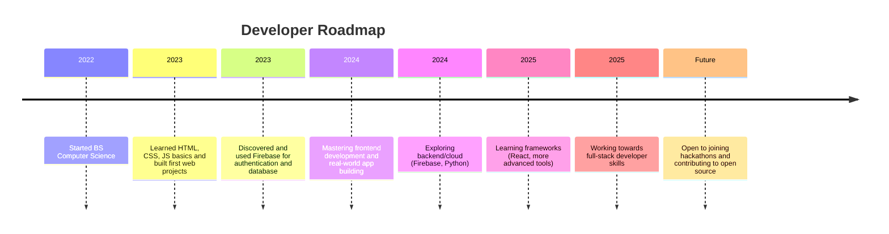

# Hi, I'm Mice De (Ash) 👋

  

  

  

---

## About me
- 🎓 Bachelor of Science in Computer Science — currently studying and applying what I learn to real projects.
- 🧠 Self-taught explorer: continuous learning through hands-on practice and project work.
- 🚀 I learn by building — small web apps and experiments that push my skills forward.

---

## Tech stack

  
  
  
  
  
  
  

---

## Roadmap & Developer Goals

<!-- GitHub's rendering of mermaid is available in many contexts, but if you want 100% compatibility,
     add a plain-text fallback below or export the diagram as an image. -->

Fallback (plain list):
- 2022: Started BS Computer Science
- 2023: Built first web projects (HTML/CSS/JS)
- 2023: Started using Firebase
- 2024: Focus on frontend + real-world apps
- 2024: Exploring backend (Firebase, Python)
- 2025: Learning frameworks (React)
- 2025: Learning design (UI/UX principles, Figma, responsive & accessible layouts)
- Future: Contribute to open source, join hackathons

---

## Interests & Hobbies
- 💻 Coding for fun and continuous growth
- 🧩 Solving logic & math problems
- 🌏 Building projects that address real-world problems

---

## Featured Projects
Coming soon — I'll add project cards and links here once I publish web apps and experiments.

---

## Certifications & Achievements
Coming soon — will list certificates and notable achievements.

---

## Collaboration
Open to joining hackathons, tech communities, and contributing to open source. Let's build something awesome together!

---

## GitHub Stats

  
  

---

## Contact

  
  
  
  
  

---

  Thank you for visiting my profile!

