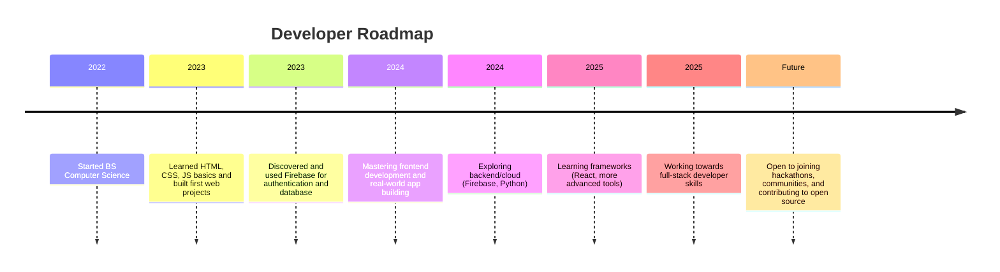

<!-- Minimalist & Modern GitHub Profile README for MiceDe27 (Ash) -->

<h1 align="center">👋 Hello there! I'm Mice De (Ash)</h1>

  

  
  
  
  
  

---

## 🎓 Educational Journey

- 🏫 **Bachelor of Science in Computer Science**  
  Currently studying and actively applying what I learn to real-world projects.
- 🧠 **Self-Taught Explorer**  
  Continuously learning through hands-on practice, online tutorials, and building projects.
- 🚀 **Project-Based Learning**  
  I believe in learning by doing—each project helps me grow my skills and deepen my understanding.

---

## 🚀 Tech Stack

- **Frontend:** HTML, CSS, JavaScript (Vanilla)
- **Backend & Cloud:** Firebase Authentication, Firestore Database
- **Other:** Python (Logic Building)
- **Tools:** Git, GitHub, VS Code, Chrome DevTools

---

## 📈 Roadmap & Developer Goals

---

## 🧠 Interests & Hobbies

- 💻 Coding for fun and continuous growth
- 🧩 Solving logic & math problems
- 🌏 Exploring real-world challenges through projects

---

## 🏆 Featured Projects

*Coming soon! Stay tuned for my web apps and experiments.*

---

## 🏅 Certifications & Achievements

📜 *Coming soon...*

---

## 👥 Communities & Collaboration

Open to joining hackathons, tech communities, and contributing to open source projects.  
Let’s connect and build something awesome together!

---

## 📊 GitHub Stats

  
  

---

## ✉️ Contact Me

- 📧 **Email:** [micedekun27@gmail.com](mailto:micedekun27@gmail.com)
- 🌐 **Facebook:** [UnpredictableFlow](https://www.facebook.com/UnpredictableFlow)
- 📷 **Instagram:** [@micede27](https://www.instagram.com/micede27?igsh=aTVpZHh1Z3pycWJt)
- 📺 **YouTube:** [@Hm.De617](http://www.youtube.com/@Hm.De617)
- 💻 **GitHub:** [MiceDe27](https://github.com/MiceDe27)

---

  <em>Thank you for visiting my profile! 
  Let’s build something amazing together.</em>

